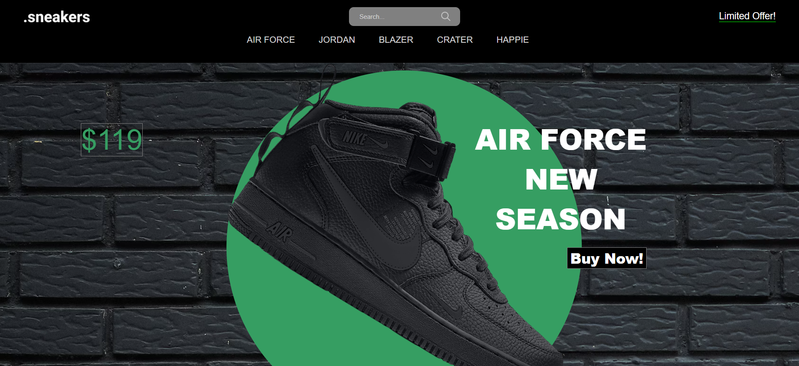
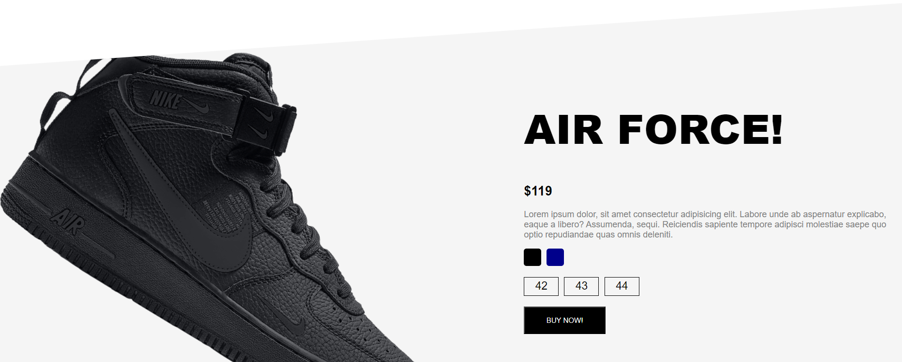

# Online Sneaker Store (Frontend)

Welcome to our Online Sneaker Store project! This project is a web-based sneaker store where users can browse and purchase sneakers.

## Table of Contents

- [Features](#features)
- [Technologies Used](#technologies-used)
- [Screenshots](#screenshots)
- [Getting Started](#getting-started)
- [Contributing](#contributing)
- [License](#license)

## Features

- Image sliding to showcase the sneakers.
- Responsive design for seamless viewing on various devices.
- Interactive user interface to browse and view various sneaker models.
- Add sneakers to the shopping cart for a convenient shopping experience.
- Intuitive checkout process to complete the purchase.

## Technologies Used

- HTML
- CSS
- JavaScript

## Screenshots

for @mobile screen!!!

## Getting Started

1. Clone the repository.
2. Open the project in your preferred code editor.
3. Open the `index.html` file to view the project in a web browser.

Feel free to explore our Online Sneaker Store! 🚀
http://127.0.0.1:5500/index.html#products